# prueba-practica-arboles-cpp-java

Sistema de gestión de estudiantes para la **Universidad Técnica de Ambato** implementado con un **Árbol Binario de Búsqueda (BST)** en C++ y Java.

---

## Descripción del proyecto

El sistema permite registrar, buscar, eliminar y consultar estudiantes. Cada nodo del árbol almacena: cédula, apellidos, nombres, nota final, carrera y nivel. La **cédula** es la clave de ordenamiento del BST.

## Estructura del repositorio

```
prueba-practica-arboles-cpp-java/
├── cpp/
│   └── estudiantes_arbol.cpp   # Implementación completa en C++
└── README.md
```

## Compilación y ejecución

### C++

```bash
# Compilar
g++ -std=c++17 -Wall -o estudiantes_arbol cpp/estudiantes_arbol.cpp

# Ejecutar
./estudiantes_arbol          # Linux/macOS
estudiantes_arbol.exe        # Windows
```

## Estructura del árbol

El BST se ordena por **cédula** (string comparación lexicográfica):

- Cédulas menores van al subárbol **izquierdo**
- Cédulas mayores van al subárbol **derecho**

```
           1804003003 (Molina)
          /                  \
  1804001001 (Pérez)    1804004004 (Vásquez)
         \                       \
   1804002002 (García)    1804005005 (Herrera)
```

## Funciones implementadas

| #   | Función                 | Descripción                                    |
| --- | ----------------------- | ---------------------------------------------- |
| 1   | `insertarEstudiante()`  | Inserta un nodo respetando el orden BST        |
| 2   | `buscarEstudiante()`    | Búsqueda O(h) por cédula                       |
| 3   | `eliminarEstudiante()`  | Eliminación con reemplazo por sucesor inorden  |
| 4   | `recorridoInorden()`    | izq → raíz → der (orden ascendente por cédula) |
| 5   | `recorridoPreorden()`   | raíz → izq → der                               |
| 6   | `recorridoPostorden()`  | izq → der → raíz                               |
| 7   | `recorridoPorNiveles()` | BFS con cola, nivel a nivel                    |
| 8   | `contarNodos()`         | Cuenta total de estudiantes                    |
| 9   | `calcularAltura()`      | Altura máxima del árbol                        |
| 10  | `buscarNotaMayor()`     | Recorre todo el árbol buscando el máximo       |
| 11  | `buscarNotaMenor()`     | Recorre todo el árbol buscando el mínimo       |
| 12  | `mostrarAprobados()`    | Nota ≥ 7.0                                     |
| 13  | `mostrarReprobados()`   | Nota < 7.0                                     |

## Conceptos aplicados

- **Recursividad**: inserción, búsqueda, eliminación, recorridos, altura, conteo
- **Punteros (C++)**: nodos enlazados dinámicamente con `Nodo*`
- **Referencias (Java)**: nodos como objetos con referencias `NodoBST`
- **Cola (queue)**: recorrido BFS por niveles
- **Clases y objetos**: `ArbolBST`, `Nodo`, `Estudiante`
- **Validación de datos**: rango de nota (0–10), nivel (1–10), campos no vacíos

## Capturas de ejecución

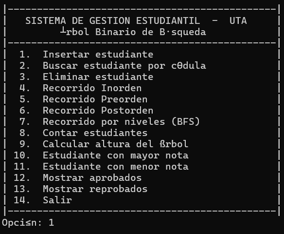
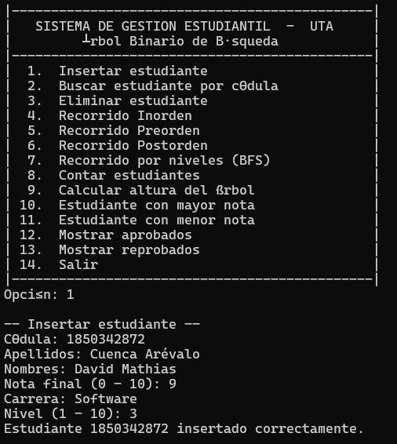
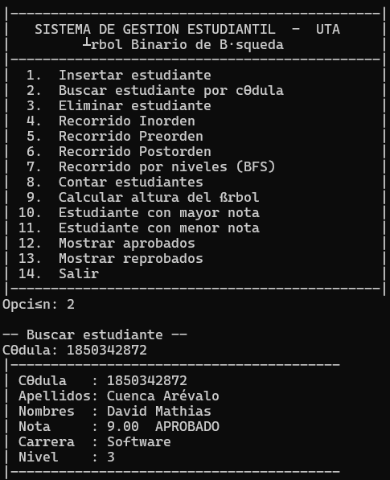
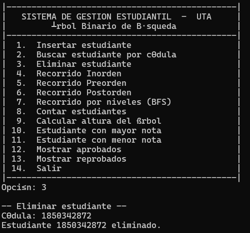
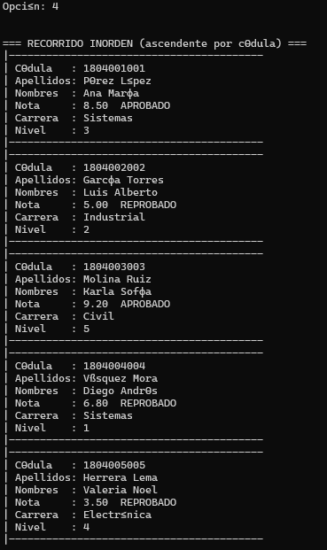
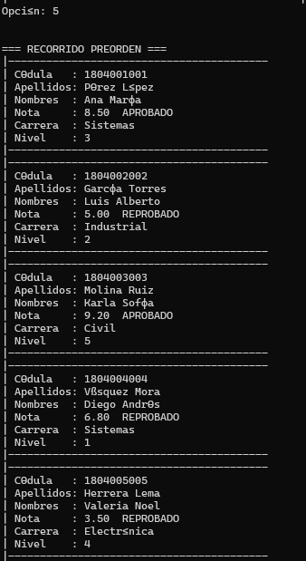
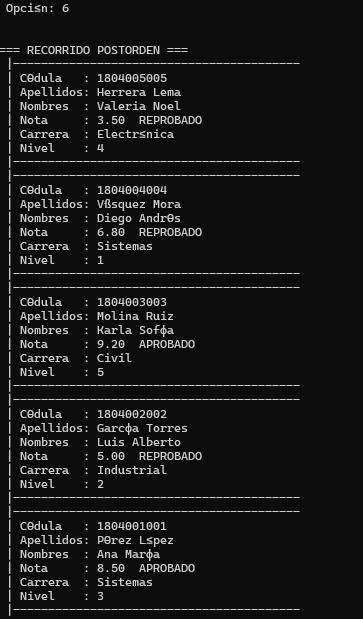
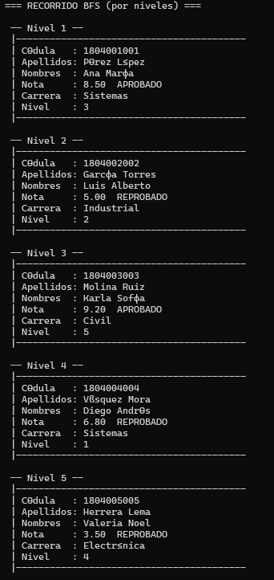
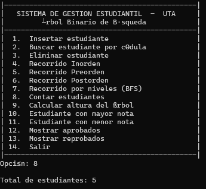
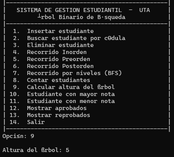
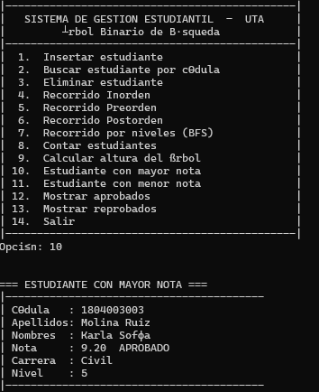
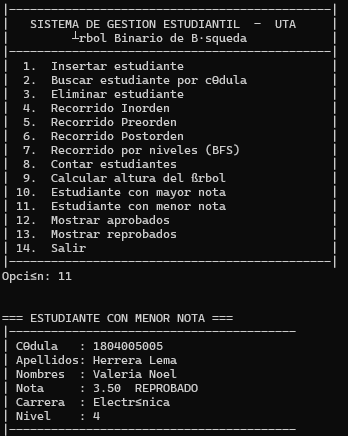
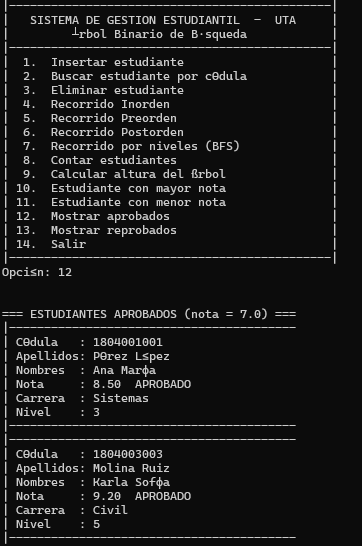
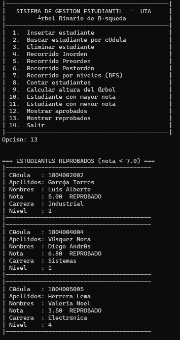

## Autor

David Mathis Cuenca Arévalo
Estructura de Datos — Universidad Técnica de Ambato
